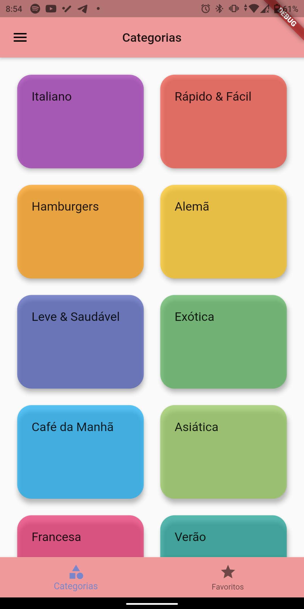
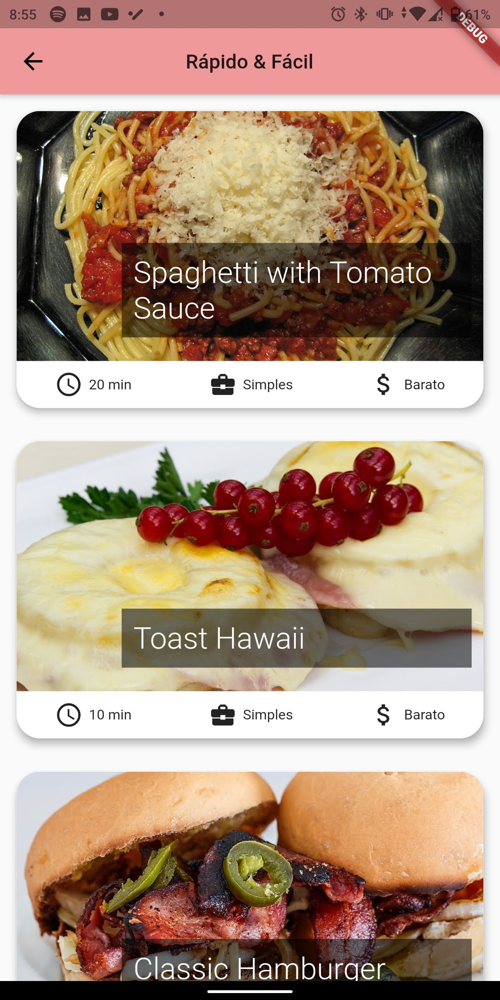
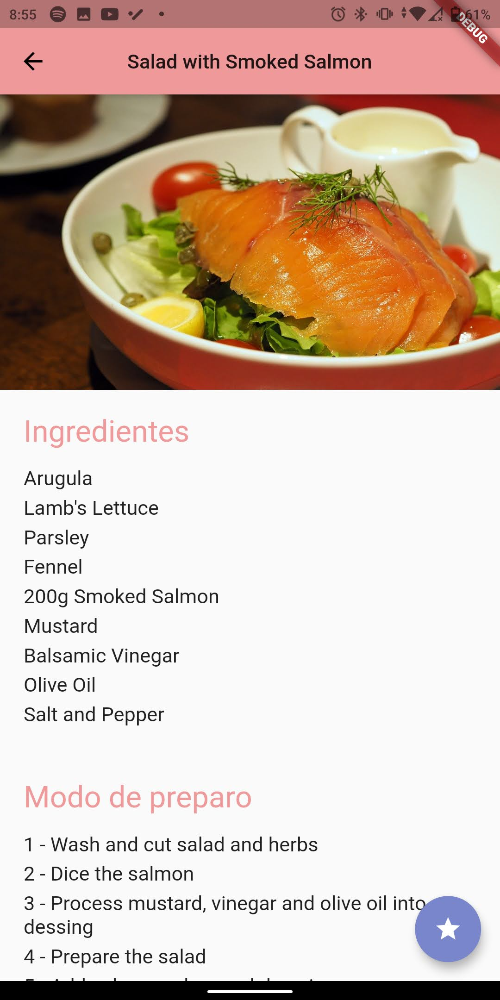
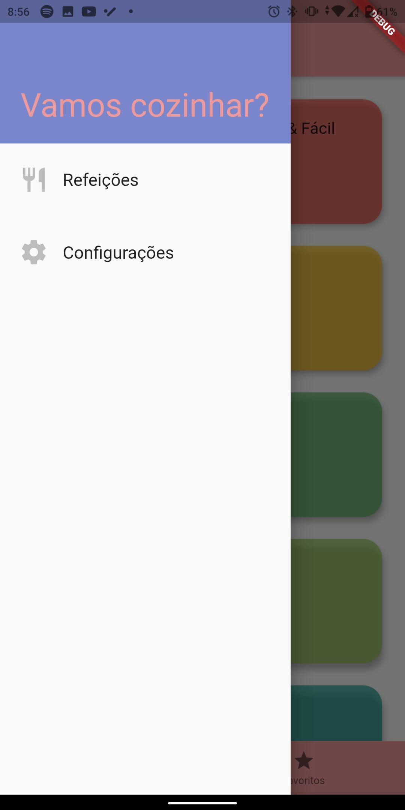
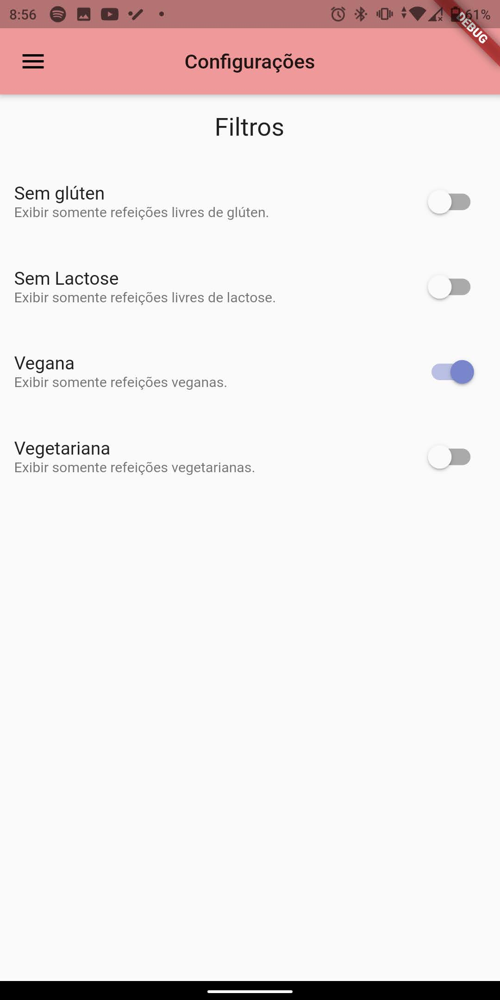
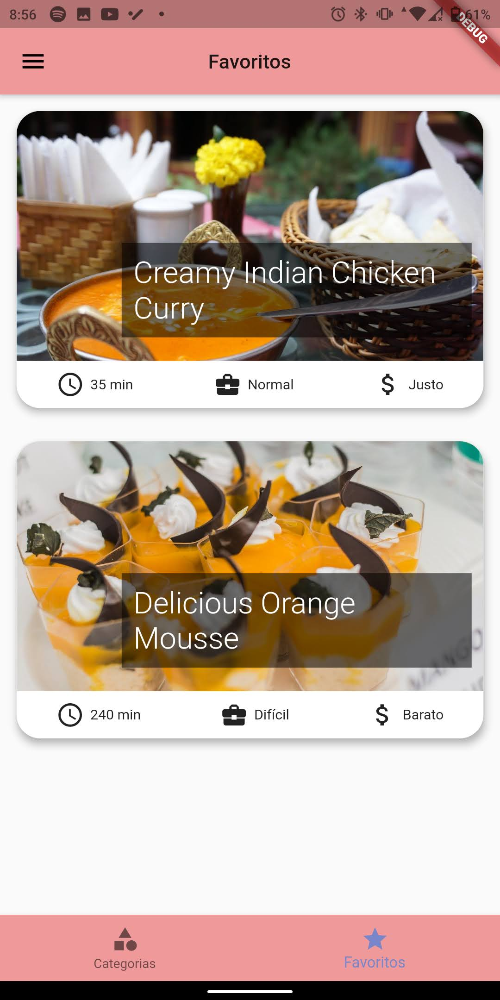

# Refeicao_Flutter

Um aplicativo no Flutter de receitas culinárias de diversos sabores.

## O que eu aprendi

Este projeto é o meu primeiro pequeno projeto usando Flutter, com isso aprendi a usar rotas e como armazenar dados na memória do smartphone.

## Uso

    

        Página inicial -> Categorias -> Receita de refeição
    

    

        
        
        
    

    

        O usuário pode filtrar os tipos de refeições e criar uma lista de refeições favoritas.
    

    

        
        
        
    

